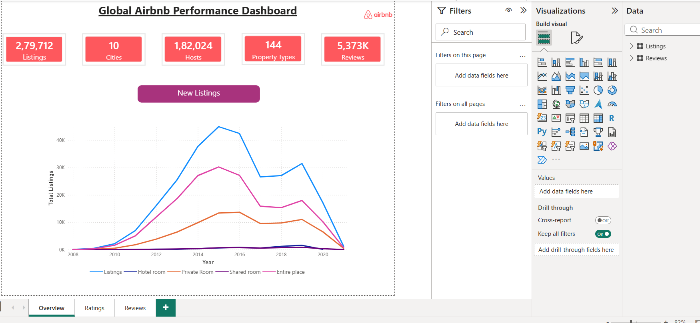
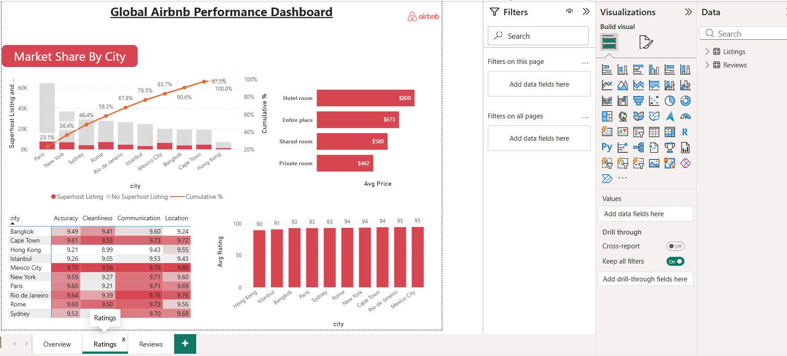
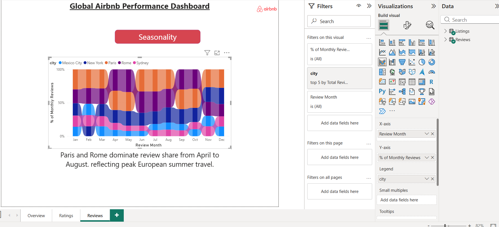

# 🏡 Global Airbnb Performance Dashboard


---

# 📖 Project Overview

The **Global Airbnb Performance Dashboard** is an interactive Power BI project that analyzes Airbnb listings across **10 major global cities**. The dashboard provides insights into listing growth, host distribution, property types, pricing, customer ratings, and seasonal review trends.

Built using **Power BI, Power Query, DAX, and data modeling**, the dashboard transforms raw data into meaningful business insights that support strategic decision-making.

---

# 🎯 Business Objectives

- Analyze Airbnb listing growth over time.
- Compare accommodation types across cities.
- Evaluate customer satisfaction using ratings.
- Understand pricing differences by property type.
- Identify seasonal travel patterns through customer reviews.
- Present business insights through interactive visualizations.

---

# 📊 Dashboard Preview

## 📌 Overview



### Highlights
- Total Listings
- Total Cities
- Total Hosts
- Property Types
- Total Reviews
- Listing Growth Trend

---

## ⭐ Ratings



### Highlights
- Superhost Market Share by City
- Average Price by Property Type
- Customer Ratings Heatmap
- Average Rating Comparison
- Property Type Pricing Analysis

---

## 📝 Reviews



### Highlights
- Monthly Review Seasonality
- City-wise Review Distribution
- Peak Tourism Analysis

---

# 📈 Key Business Insights

### 📌 Listing Trends
- Airbnb listings experienced rapid growth between **2011 and 2015**.
- Listing growth stabilized after 2016.
- Listings declined significantly during the global travel slowdown around 2020.

### 🏠 Property Types
- **Entire Place** is the most popular accommodation type.
- Hotel Rooms represent the smallest inventory but command the highest average price.

### 💰 Pricing Analysis
- Hotel Rooms have the highest average listing price.
- Private Rooms offer more budget-friendly accommodation.

### ⭐ Customer Ratings
- Mexico City and Rio de Janeiro recorded the highest average customer ratings.
- Communication received the strongest ratings across cities.

### 🌍 Seasonal Trends
- Paris and Rome recorded the highest review activity during the European summer season.
- Review activity shifts toward North American cities later in the year.

---

# 🛠 Tools & Technologies

- Microsoft Power BI
- Power Query
- DAX
- Data Modeling
- Data Cleaning
- Data Visualization
- Business Intelligence

---

# 📁 Repository Contents

```text
📂 Airbnb-PowerBI-Dashboard
│
├── README.md
├── Overview.png
├── Ratings.png
├── Reviews.png
└── Airbnb_Dashboard_Insights_Report.pdf
```

> **Note:** The Power BI (.pbix) file exceeds GitHub's 100 MB file size limit and is therefore not included in this repository.

---

# 📄 Business Insights Report

A detailed business insights report summarizing the dashboard findings is included in this repository.

**File:** `Airbnb_Dashboard_Insights_Report.pdf`

---

# 🚀 Skills Demonstrated

- Business Intelligence
- Dashboard Design
- Data Storytelling
- KPI Development
- DAX
- Data Modeling
- Trend Analysis
- Pricing Analytics
- Customer Analytics
- Interactive Dashboard Development

---

# 👨‍💻 Author

**Gaurav Chauhan**

🔗 LinkedIn: *(Add your LinkedIn profile URL here)*

---

## ⭐ If you found this project interesting, consider giving it a star!
